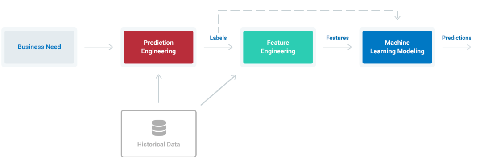

# AutoML for Customer Churn

Automated customer churn end-to-end pipeline:

* Deep Feature Synthesis: https://blog.featurelabs.com/deep-feature-synthesis/

* Automated Feature Engineering: https://towardsdatascience.com/why-automated-feature-engineering-will-change-the-way-you-do-machine-learning-5c15bf188b96

* Incremental Learning: https://en.wikipedia.org/wiki/Incremental_learning

* Genetic Algorithms that evolve with data/churn: https://www.sciencedirect.com/science/article/abs/pii/S2210650216301754

The end outcome is a both a specific solution to a customer churn use case, with a reduction in revenue lost to churn of more than 10%, 
as well as a general approach you can use to solve your own problems with machine learning. 

# Framework Steps

1. __Prediction engineering__
  * State business need
  * Translate business requirement into machine learning task by specifying problem parameters
  * Develop set of labels along with cutoff times for supervised machine learning
2. __Feature Engineering__
  * Create features - predictor variables - out of raw data 
  * Use cutoff times to make valid features for each label
  * Apply automated feature engineering to automatically make hundreds of relevant, valid features 
3. __Modeling__
  * Train a machine learning model to predict labels from features
  * Use a pre-built solution with common libraries
  * Optimize model in line with business objectives

# Application to Customer Churn

Real-world use case and dataset to deliver actual business value from Kaggle, download [here](https://www.kaggle.com/c/kkbox-churn-prediction-challenge/data).

Within the overall scaffolding, several standard data science toolboxes are used to solve the problem:

* Automated feature engineering for churn
* Data munging and engineering
* Some standard machine learning algorithms for churn
* PySpark Running comptutations in parallel
* Model selection optimization using genetic algorithms

# Results

The final results comparing several models are shown below:

| Model                                     | ROC AUC | Recall | Precision | F1 Score |
|-------------------------------------------|---------|--------|-----------|----------|
| Naive Baseline (no ml)                    | 0.5     | 3.47%  | 1.04%     | 0.016   |
| Logistic Regression                       | 0.577   | 0.51%  | 2.91%     | 0.009   |
| Random Forest Default                     | 0.929   | 65.2%  | 14.7%     | 0.240   |
| Random Forest Tuned for 75% Recall        | 0.929   | 75%    | 8.31%     | 0.150    |
| Auto-optimized Model                      | 0.927   | 2.88%  | 64.4%     | 0.055   |
| Auto-optimized Model Tuned for 75% Recall | 0.927   | 75%    | 9.58%     | 0.170    |

__Final Confusion Matrix__

__Feature Importances__

# Code files inside Churn folder:

1. Partitioning Data: Separate data into independent subsets to run operations in parallel.
2. Prediction Engineering: Create labels based on the business need and historical data.
3. Automated Feature Engineering: Implement automated feature engineering workflow using label times and raw data
4. Feature Engineering on Spark: Parallelize feature engineering calculations by distributing across multiple machines
5. Modeling: develop machine learning algorithms to predict labels from features; use automated genetic search tools to search for best model (leaderboard).

# Feature Engineering with Spark

To scale the feature engineering to a large dataset, the data was partitioned and automated feature engineering was run in parallel
using Apache Spark with PySpark. 

This code can support scaling to multiple cores on one machine natively or to multiple machines using a Dask cluster. However, this
approach shows that Spark can also be used to parallelize feature engineering resulting in reduced run times even on large datasets.

## Need help integrating this into your data?

If ML/AI for your customers is important to you or your business, please [get in touch](https://www.linkedin.com/in/computer-vision-engineer/).

### Contact

Email: joehoeller@gmail.com

